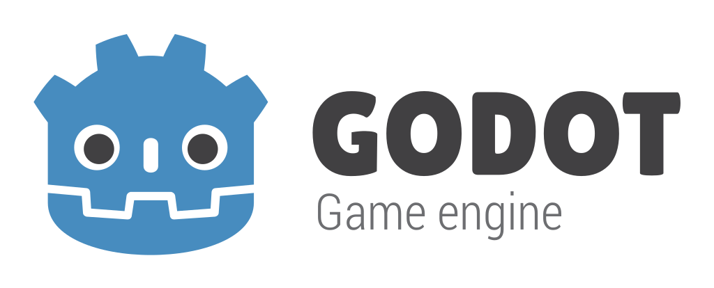

# Godot Engine — LiveMount Fork

This is a Godot engine fork that adds the **LiveMount** module (`modules/livemount/`), enabling dynamic project mounting, running, and unmounting at runtime without restarting the engine.

## LiveMount Module

LiveMount replaces the standard editor UI with a lightweight shell that can load any Godot project on the fly. This is designed for iOS development workflows where rebuilding the app for each project change is impractical.

### Features

- **Dynamic mounting** — load a Godot project (scenes, scripts, resources, autoloads) at runtime
- **Clean unmounting** — tear down all project state and return to the shell
- **Hot remounting** — swap projects without restarting the engine
- **WebSocket sync** — receive file updates from a development server
- **C bridge API** — pure C interface (`livemount_ios_bridge.h`) for Swift/ObjC integration
- **Automated tests** — 226-check regression suite via `--livemount-test`

### Building

```bash
# iOS Simulator
scons platform=ios target=editor arch=arm64 simulator=yes module_livemount_enabled=yes -j$(sysctl -n hw.ncpu)

# iOS Device
scons platform=ios target=editor arch=arm64 module_livemount_enabled=yes -j$(sysctl -n hw.ncpu)

# Linux (for testing)
scons platform=linuxbsd target=editor module_livemount_enabled=yes -j$(nproc)
```

### CLI Flags

| Flag | Description |
|---|---|
| `--livemount` | Boot into LiveMount shell instead of the editor |
| `--livemount-mount <path>` | Auto-mount a project at startup |
| `--livemount-scene <scene>` | Override the target scene |
| `--livemount-test` | Run the automated regression test suite |
| `--livemount-sync` | Auto-start the WebSocket sync server |

### Module Structure

```
modules/livemount/
  register_types.cpp/h      Module registration (10 singletons)
  livemount_shell.cpp/h      Interactive shell UI + test runner
  livemount_debug.cpp/h      Runtime metrics tracking
  livemount_ios_bridge.cpp/h Pure C API for Swift/ObjC callers
  launch_controller.cpp/h    Mount/unmount orchestration
  project_domain_manager.*   Project lifecycle
  script_domain_manager.*    Script cache management
  resource_domain_manager.*  Resource tracking
  autoload_session_manager.* Autoload lifecycle
  project_settings_layer_manager.*  Settings isolation
  import_session_manager.*   Import pipeline state
  git_manager.*              Git operations
  sync_server.*              WebSocket file sync
  config.py / SCsub          Build configuration
```

### Integration Points

- `main/main.cpp` — CLI flag parsing, shell creation, editor bypass
- `platform/ios/main_ios.mm` — auto-inject `--livemount` on iOS, log bridging
- `drivers/apple_embedded/bridging_header_apple_embedded.h` — exposes C bridge to Swift

---

<p align="center">
  <a href="https://godotengine.org">
    
  </a>
</p>

## 2D and 3D cross-platform game engine

**[Godot Engine](https://godotengine.org) is a feature-packed, cross-platform
game engine to create 2D and 3D games from a unified interface.** It provides a
comprehensive set of [common tools](https://godotengine.org/features), so that
users can focus on making games without having to reinvent the wheel. Games can
be exported with one click to a number of platforms, including the major desktop
platforms (Linux, macOS, Windows), mobile platforms (Android, iOS), as well as
Web-based platforms and [consoles](https://godotengine.org/consoles).

## Free, open source and community-driven

Godot is completely free and open source under the very permissive [MIT license](https://godotengine.org/license).
No strings attached, no royalties, nothing. The users' games are theirs, down
to the last line of engine code. Godot's development is fully independent and
community-driven, empowering users to help shape their engine to match their
expectations. It is supported by the [Godot Foundation](https://godot.foundation/)
not-for-profit.

Before being open sourced in [February 2014](https://github.com/godotengine/godot/commit/0b806ee0fc9097fa7bda7ac0109191c9c5e0a1ac),
Godot had been developed by [Juan Linietsky](https://github.com/reduz) and
[Ariel Manzur](https://github.com/punto-) for several years as an in-house
engine, used to publish several work-for-hire titles.


## Getting the engine

### Binary downloads

Official binaries for the Godot editor and the export templates can be found
[on the Godot website](https://godotengine.org/download).

### Compiling from source

[See the official docs](https://docs.godotengine.org/en/latest/engine_details/development/compiling)
for compilation instructions for every supported platform.

## Community and contributing

Godot is not only an engine but an ever-growing community of users and engine
developers. The main community channels are listed [on the homepage](https://godotengine.org/community).

The best way to get in touch with the core engine developers is to join the
[Godot Contributors Chat](https://chat.godotengine.org).

To get started contributing to the project, see the [contributing guide](CONTRIBUTING.md).
This document also includes guidelines for reporting bugs.

## Documentation and demos

The official documentation is hosted on [Read the Docs](https://docs.godotengine.org).
It is maintained by the Godot community in its own [GitHub repository](https://github.com/godotengine/godot-docs).

The [class reference](https://docs.godotengine.org/en/latest/classes/)
is also accessible from the Godot editor.

We also maintain official demos in their own [GitHub repository](https://github.com/godotengine/godot-demo-projects)
as well as a list of [awesome Godot community resources](https://github.com/godotengine/awesome-godot).

There are also a number of other
[learning resources](https://docs.godotengine.org/en/latest/community/tutorials.html)
provided by the community, such as text and video tutorials, demos, etc.
Consult the [community channels](https://godotengine.org/community)
for more information.

[](https://www.codetriage.com/godotengine/godot)
[](https://hosted.weblate.org/engage/godot-engine/?utm_source=widget)
