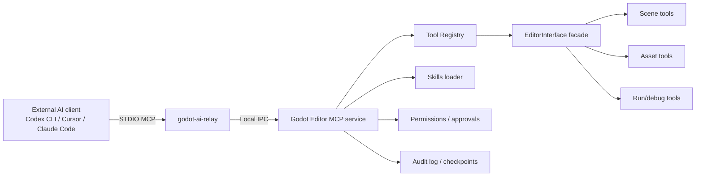
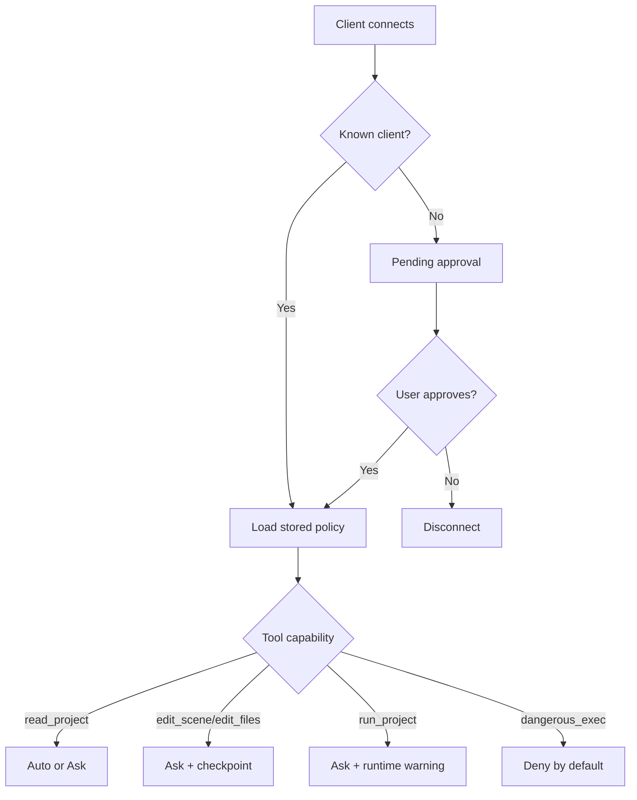

# Cloning Unity AI Tooling into a Godot Fork

## Executive summary

Unity’s current AI tooling is not a single feature but a stack: a Unity Editor package (`com.unity.ai.assistant`), an MCP bridge exposed to external clients, a relay executable launched by those clients, filesystem-scanned skills defined by `SKILL.md`, an Assistant API that can run workflows headlessly, AI Gateway support for external agents such as Claude Code and Cursor CLI, built-in editor actions for file/scene/code manipulation, and workflow affordances such as screenshots, checkpoints, and specialised skills. Unity’s documentation also shows explicit support for custom MCP tools, dynamic schema-based registration, and runtime registration via `McpToolRegistry`.

A Godot fork can clone most of the *behavioural model* of this stack with high fidelity, but not all of it should be implemented in the same layer. The highest-value path is a hybrid design: keep the protocol/relay/agent-facing pieces outside the engine where possible, and put only the editor-control primitives and low-level hooks inside the engine or an editor module. Godot already exposes strong editor extension surfaces through `EditorPlugin`, `EditorInterface`, `EditorFileSystem`, `FileSystemDock`, `EditorScript`, `EditorCommandPalette`, `EditorImportPlugin`, `EditorExportPlugin`, the scene playback API, command-line flags such as `--headless` and `--script`, and runtime inspection paths through the remote debugger and embedded game tools. Those APIs are sufficient for a first-class AI editor integration; a fork becomes necessary mainly for deep, stable, supported automation hooks, safer permission boundaries, and a built-in MCP server lifecycle.

My overall assessment is that a Godot clone of Unity AI tooling is **feasible** and can be delivered incrementally. The must-have tranche is an MCP-compatible tool server, a relay/CLI entry point, read/write scene and asset tools, run/play/debug tools, explicit user approvals, and filesystem-scanned skills. The highest-risk areas are safe editor mutation, transactionality and undo, remote inspection of the running game, and cross-platform packaging of binaries. The lowest-risk areas are AGENTS-style repository guidance, SKILL-style workflow packaging, and command-palette-triggered or headless script execution.

Because the requester did not specify a Godot branch or commit, the Godot source locations below are based on the current official documentation and the repository’s current `master` branch as surfaced in the reviewed sources. Where a precise hook function could not be confirmed from the reviewed sources, I mark it as **unspecified** rather than guessing.

## Unity feature inventory and what it implies

Unity’s AI tooling is packaged as the `com.unity.ai.assistant` package. The Unity 6 manual describes Assistant as an in-editor system for project-aware information retrieval, troubleshooting, code generation, scene editing, automation, and asset workflows. The package changelog further shows that `com.unity.ai.toolkit` and `com.unity.ai.generators` were merged into `com.unity.ai.assistant`, reinforcing that this package is the primary delivery vehicle rather than a loosely related set of packages.

Unity MCP is documented as being built on the open Model Context Protocol. Unity’s MCP flow has three core runtime pieces: the Unity Editor-side bridge, a relay executable installed automatically under `~/.unity/relay/`, and an external MCP-compatible client such as Claude Code, Cursor, Windsurf, or Claude Desktop. The relay is what the client launches, and the `--mcp` flag makes it operate as an MCP server. Unity’s MCP settings page exposes bridge status, connected clients, prior connections, tool listings, and integration helpers that can auto-configure supported clients.

Unity also supports a separate AI Gateway path for third-party agents inside Assistant. The reviewed Unity docs say AI Gateway supports Claude Code, Cursor CLI, and bundled Codex CLI and Gemini CLI; it also lets the user point Assistant to an agent executable with a `CLI Path`, and define environment variables such as API keys. That means Unity’s architecture is not “Unity ships the model runtime” so much as “Unity mediates agent execution, editor capabilities, and credentials”.

For MCP tools, Unity exposes a real registration model rather than a one-off hardcoded command list. `McpToolRegistry` is described as a central registry that discovers attribute-decorated tools at editor startup using `TypeCache`, including static methods marked with `[McpTool]` and classes implementing `IUnityMcpTool` or `IUnityMcpTool<T>`. Unity also documents four registration approaches: typed static methods, `JObject`-based methods with custom schemas, class-based tools, and runtime API registration. The reviewed documentation explicitly says schemas can be generated from parameter types, and that custom `GetInputSchema()` and `GetOutputSchema()` are supported for untyped tools.

Unity exposes at least some built-in tool classes by name in its docs. The reviewed pages mention `Unity_ManageScene`, `Unity_ManageGameObject`, `Unity_ReadConsole`, and `Unity_ManageScript`. The MCP settings page further exposes a validation level specifically for `Unity_ManageScript`, indicating that Unity distinguishes between ordinary editor queries and riskier code-editing or code-generation operations.

Unity Skills are also structured, not ad hoc. Assistant can discover `SKILL.md` files from project folders under `Assets`, user-level skill folders, and installed packages under `Packages/<package-name>/AIAssistantSkills/.../SKILL.md`. The skill file uses YAML frontmatter plus instruction text; optional supporting resources can live in sibling folders and are loaded on demand. The docs also show frontmatter fields such as `name`, `description`, enable flags, and a `tools` list, plus editor version gating added in the changelog. Importantly, skills are discoverable but not automatically trusted: Unity requires the user to explicitly change a discovered skill from **Deny** to **Allow** before Assistant can use it.

The Unity docs make clear that skills are more than markdown prompts. Skills can rely on built-in Assistant actions such as reading project files and assets, querying scene objects and component data, capturing screenshots, and running or editing C# code. Assistant also supports specialised skills, such as camera setups, UI generation, scene creation, asset creation, and performance analysis. That means any Godot clone that focuses only on MCP tools but omits workflow packaging would reproduce only half of Unity’s developer experience.

Unity’s Assistant API is another concrete feature, and it matters for clone design. Unity documents `AssistantApi.Run`, `PromptThenRun`, and `RunHeadless`; `RunHeadless` runs an `IAgent` without opening the Assistant window and returns the final answer as a string. This is a direct precedent for supporting “agent playing” or headless automation in Godot, and it strongly suggests that the Godot design should include both UI-backed and headless execution modes.

Unity also ships workflow-level safety and context features. Automatic screenshot capture is limited to the Unity Editor and project views. Checkpoints can be created automatically before Assistant changes the project, and restoration reverts later changes while preserving conversation history as archived state. The changelog additionally shows `Plan mode`, a `Grep tool`, an `ask_user` tool UI, and a public `AgentTool` API for Assistant tools. These are not core MCP requirements, but they are part of the practical product surface that makes the agent usable and safer.

### Inventory table

| Unity feature | Concrete Unity evidence | Behaviour | Godot clone recommendation | Complexity |
|---|---|---|---|---|
| MCP bridge/server | Unity MCP settings page shows bridge state, clients, tools, integrations | Editor-side server for external AI clients | Add built-in MCP server service in editor or module | Medium |
| Relay executable | Relay auto-installed under `~/.unity/relay/`; clients launch it with `--mcp` | Client-facing process wrapper | Ship `godot-ai-relay` binary with stdio transport | Medium |
| Custom MCP tools | `McpToolRegistry`, `[McpTool]`, runtime register/unregister, typed and custom schemas | Discoverable schema-defined tools | Native registry plus plugin/GDExtension registration | Medium |
| Skills | `SKILL.md`, scanned locations, YAML frontmatter, optional tools, allow/deny | Reusable workflow packaging | Filesystem-scanned skills in project/user/plugin paths | Small |
| Assistant package | `com.unity.ai.assistant` package is primary delivery point | In-editor UX plus APIs | Start as editor plugin; fork only for deep integration | Medium |
| AI Gateway / external agents | Claude Code, Cursor CLI, bundled Codex/Gemini, CLI path, env vars | External agents can drive editor actions | Support agent backends via relay config and env vars | Medium |
| Headless agent API | `RunHeadless` returns final answer string | Headless workflow execution | Add headless CLI and API service in editor | Medium |
| Screenshots | Automatic capture limited to editor/project views | Visual context tooling | Add viewport capture tools with permission prompts | Medium |
| Checkpoints | Automatic project checkpoint before changes; later restore possible | Revertibility / safety | Git-backed or snapshot-backed checkpoint system | Large |
| Plan / grep / ask_user | Changelog lists all three | Workflow helpers | Implement as optional built-in tools | Small to Medium |

## Godot mappings and the most relevant engine hook points

Godot already provides strong editor extension APIs. `EditorPlugin` is the main extension point for editor functionality; `EditorInterface` exposes scene load/save/open, object inspection and editing, editor windows, the file system dock, current paths, and play/stop controls; `EditorFileSystem` gives the editor’s indexed view of project files; `FileSystemDock` exposes path navigation and file-related signals; `EditorScript` can run one-off editor automation; `EditorCommandPalette` already exists for command-style UX; and `EditorImportPlugin`/`EditorExportPlugin` cover import/export extension points.

For scene manipulation, the natural Godot substrate is `SceneTree` plus `EditorInterface` methods that expose the currently edited scene root, object editing, scene save/open, and project playback. `SceneTree` manages node hierarchy, current scene, pausing, loading, switching, and grouping; `EditorInterface` binds `edit_node`, `edit_resource`, `inspect_object`, `save_scene`, `save_all_scenes`, `open_scene_from_path`, `play_main_scene`, `play_current_scene`, `play_custom_scene`, `stop_playing_scene`, and `is_playing_scene`. Those bindings are enough to implement Unity-like scene, asset, and run/play tools as first-class Godot editor actions.

For real-time asset updates, the key Godot pieces are `EditorFileSystem` and `FileSystemDock`. `EditorFileSystem` scans the project tree, exposes `update_file`, and emits `filesystem_changed`; `FileSystemDock` is the editor-facing UI layer and already integrates with `EditorResourcePreview` and the editor’s undo/redo facilities. This maps well to Unity-style “realtime asset update” features, especially if the agent should modify files and immediately reflect them in the editor without requiring restart or manual reimport.

For “agent playing” and inspection of a running game, Godot already has more than one usable path. `EditorInterface` can start and stop scenes. The CLI supports `--remote-debug`, and the editor has remote-scene-tree and remote-inspector refresh settings. Godot’s embedded game tooling also lets the editor inspect and modify properties of selected nodes in the running game, with the documented warning that such changes are not preserved after stopping. That makes runtime inspection feasible immediately; what is missing is a deliberately exposed, stable tool layer over those facilities.

For command execution and custom commands, Godot already has the core primitives. `EditorCommandPalette` can hold named commands and sectioned keys. `EditorScript` can be run from the script editor and even appear in the command palette when given a `class_name`. `Making plugins` also documents editor plugins in both GDScript and C#, so the custom-command layer can be implemented without requiring a fork at first.

For binary distribution and native IPC helpers, Godot’s GDExtension system is the most obvious non-fork option. GDExtension lets the engine interact with native shared libraries at runtime, with `.gdextension` files describing how to load them. This is useful if you want a plugin-delivered MCP server, relay wrapper, or OS-keychain/credential adapter without immediately patching the engine core.

### Recommended hook locations in the Godot source tree

The table below focuses on the most useful *specific* engine touchpoints visible in the reviewed sources. If a function-level insertion point is not confirmed, it is marked as unspecified.

| Goal | Suggested file / class | Evidence from reviewed sources | Why it matters |
|---|---|---|---|
| Boot editor-side AI services | `editor/editor_node.cpp` | Official editor development docs call it the main editor initialisation file and the effective “main scene” of the editor. | Best place to start built-in MCP server, permissions UI, skill scan bootstrap |
| Expose editor actions to tools | `editor/editor_interface.cpp` / `EditorInterface` | Binds file-system access, open/edit/save scene, inspect/edit object, play/stop scene, restart editor. | Ideal façade for tool execution |
| Asset scan / refresh / notifications | `editor/file_system/editor_file_system.cpp` / `EditorFileSystem` | `_scan_filesystem`, `update_file`, `filesystem_changed`, `filesystem_changed` signal emission. | Core for file update propagation and watch behaviour |
| File-system UI interactions | `editor/docks/filesystem_dock.cpp` / `FileSystemDock` | Integrates previews and undo/redo; front-end for file browsing. | Useful for selection, previews, path navigation, rename/move flows |
| Runtime inspection / remote scene tools | `editor/debugger/script_editor_debugger.cpp` | Source includes remote debugger and multiple editor/debugger components. | Best candidate for runtime scene inspection tools and “agent playing” observability |
| Debug adapter / external debug bridge | `editor/debugger/debug_adapter/debug_adapter_server.h` and corresponding implementation | `DebugAdapterServer` is an `EditorPlugin` with `start()` and `stop()`. | Reusable pattern for external protocol server lifecycle |
| CLI/headless entry points | `main/main.cpp` | Exposes `--headless`, `--script`, `--remote-debug`; includes editor/debugger/editor types for tool builds. | Best place for relay bootstrap or headless editor automation |
| 2D/3D editor visual hooks | `editor/scene/canvas_item_editor_plugin.cpp`, `editor/scene/3d/node_3d_editor_plugin.cpp` | Official editor development docs list both as core viewport/editor files. | Useful for screenshot capture, selection overlays, runtime visual actions |
| Scene-dock mutation hooks | **Path likely** `editor/docks/scene_tree_dock.cpp`; function-level hook unspecified | Referenced by editor sources and issue/changelog traces, but precise insertion point was not confirmed from reviewed sources. | Relevant for add/remove/reparent node tools |

### Mapping by Unity feature

| Unity feature | Closest Godot subsystem/API | Feasibility | Notes |
|---|---|---|---|
| MCP tool registry | `EditorPlugin`, `EditorInterface`, optional GDExtension, new registry service | High | Godot lacks a built-in MCP registry, but extension APIs are sufficient to add one |
| Relay / bridge | New external relay binary; optional editor module; `main/main.cpp` CLI flags | High | Best implemented as external binary plus editor-side local socket/pipe |
| Skills / `SKILL.md` | Filesystem scan via `EditorFileSystem`; editor plugin settings page; `FileAccess` | High | Very natural fit |
| `AGENTS.md`-style guidance | Project-root file scan plus command-palette/assistant boot preload | High | No engine changes needed for basic version |
| Assistant package | Editor plugin first, engine fork later if deeper hooks needed | Medium | Plugin is easier; fork only for stable privileged APIs |
| Realtime asset update | `EditorFileSystem.update_file`, `filesystem_changed`, `FileSystemDock` | High | Already supported structurally |
| Agent playing | `EditorInterface.play_*`, remote debugger, game embedding, remote scene tree | Medium | Feasible, but needs careful state model and safety |
| Custom commands | `EditorCommandPalette`, `EditorScript`, editor menus | High | Already in place |
| Screenshot / visual tools | 2D/3D editor plugins, embedded game surface, resource previews | Medium | Needs explicit UI and permissioning |
| Checkpoints | Godot project snapshots / VCS integration / scene autosave | Medium to Low | Strong UX value, but significantly more work than tools themselves |
| Export/package integration | `EditorExportPlugin`, `EditorExportPlatformExtension`, CLI | Medium | Useful for shipping agent runtimes or templates |

## Feasibility, priorities, effort and implementation plan

The best implementation plan is not “clone every Unity surface into the fork immediately”. It is to build a **progressive compatibility stack**: first expose a minimal, safe, MCP-compatible editor control plane; then add workflow packaging via skills; then add runtime inspection and visual tooling; and only after that decide whether a deeper fork is justified for performance, permissions, or packaging. This sequencing follows both Unity’s feature stack and Godot’s current architecture.

### Must-have features

| Feature | Effort | Why it is must-have | Key implementation steps | Key tests |
|---|---|---|---|---|
| MCP-compatible tool server | Medium | Core interoperability surface for external agents | Add `GodotToolRegistry`; expose `tools/list` and `tools/call`; map tools to `EditorInterface` and read-only project queries | Schema validation, pagination, notification tests, tool call determinism |
| External relay / CLI bridge | Medium | Lets Claude/Cursor/Codex-style clients connect locally | Ship `godot-ai-relay`; support stdio transport; resolve editor instance via local socket/pipe; add `--mcp` relay flag | Launch from client, reconnect, stale editor detection, multiple-client rejection or multiplex rules |
| Read/write scene and asset tools | Medium | Reproduces Unity’s practical editor-control value | Implement tool bundle for scene open/save, node query, node create/delete/reparent, asset list/read/write, console/log read | Undo/redo correctness, save semantics, import refresh, failure rollback |
| Skills with `SKILL.md` | Small | Gives reusable workflows and discoverability | Scan project/user/plugin skill roots; parse YAML frontmatter; add allow/deny UI; load support files on demand | Discovery tests, version-gating, malformed YAML, permission state persistence |
| Approval and capability permissions | Medium | Essential safety boundary | Add per-client approval, per-tool allow/ask/deny, read-only vs mutating capability classes | First-connect approval, denied-tool path, batch/headless behaviour |
| Command palette and headless execution hooks | Small to Medium | Needed for local automation and scripted runs | Register assistant actions in command palette and CLI; expose headless mode via editor session or helper process | Headless runs, output capture, non-interactive failure modes |

### High-value features

| Feature | Effort | Why it matters | Key implementation steps | Key tests |
|---|---|---|---|---|
| Runtime play / stop / inspect tools | Medium | Enables “agent playing” and debugging loops | Wrap `play_current_scene`, `stop_playing_scene`, remote debug info, embedded game selection | Play lifecycle, remote scene refresh, no persistence confusion |
| Screenshot / visual-context tools | Medium | Strongly improves rendering/debug/design workflows | Capture editor viewport and optionally embedded game window with user approval | Permission prompts, correct surface capture, headless rejection |
| Ask-user UI tool | Small | Human-in-the-loop clarification | Provide modal or docked multi-question UI similar to Unity’s `ask_user` | Form validation, cancellation, timeout, structured response schema |
| Grep / search tools | Small | High ROI for repo-aware agents | Project-text grep, resource/class search, scene-node search, asset-type filter | Unicode, large projects, ignored directories |
| Project-level checkpoints | Large | Safer mutation and user trust | Integrate Git when present; fallback snapshot metadata; restore workflow | Large-project behaviour, restore accuracy, conflict handling |

### Optional features

| Feature | Effort | Why it is optional | Key implementation steps | Key tests |
|---|---|---|---|---|
| In-editor hosted LLM chat UI | — | **Superseded (DEC-0013, 2026-08-27): built, shipped, then removed.** The Agent Terminal is the one conversation surface; a second one duplicated it while doing less. This row stays so nobody rebuilds it | — | — |
| Packaged agent backends | Medium | Convenience rather than core capability | Bundle selected agent launchers or adapters | Credential storage, updater behaviour, version pinning |
| Export-template AI integration | Medium to Large | More packaging complexity than immediate developer value | Decide whether exported games need agent/runtime or editor-only tooling | Export compatibility, platform matrix |
| Multi-user / remote HTTP MCP deployment | Medium | Powerful, but local stdio is enough initially | Add Streamable HTTP variant only after local design stabilises | Auth, session isolation, concurrent clients |

### Recommended order of work

The most sensible order is: first the **registry and relay**, then **tool implementations**, then **skills**, then **permissions**, then **runtime play/inspect**, then **checkpoints**. If you attempt checkpoints or embedded chat UX before the core registry and tool boundaries are stable, you will lock in the wrong abstractions. This follows the MCP architecture itself, where hosts discover tools and then call them over a transport, rather than relying on editor-specific UI first.

## Proposed MCP-compatible design for Godot

The cleanest design is a **two-process local architecture**. The external client launches `godot-ai-relay` over stdio, because stdio is the de facto local MCP shape and is explicitly recommended as a standard transport. The relay then talks to the running Godot editor over a private local IPC channel. This mimics Unity’s split between the client-launched relay and the editor-side bridge, while letting the Godot editor remain responsible for project context, tool execution, and approvals.



The protocol surface should stay close to MCP instead of inventing a Unity-specific dialect. At minimum, the Godot system should implement `tools/list`, `tools/call`, and `notifications/tools/list_changed`, with tool definitions using JSON Schema for `inputSchema` and optional `outputSchema`. That matches the MCP tools specification, which defines discovery via `tools/list`, execution via `tools/call`, and list-change notifications for dynamic tool sets.

The relay should support at least these flags:

```text
godot-ai-relay --mcp
godot-ai-relay --editor-socket <path-or-port>
godot-ai-relay --project <godot-project-path>
godot-ai-relay --instance <editor-instance-id>
godot-ai-relay --log-level <error|warn|info|debug>
godot-ai-relay --read-only
godot-ai-relay --approval-mode <ask|allow|deny>
```

That flag set is not copied from Godot, but it aligns with Unity’s documented `--mcp` relay mode and with MCP stdio transport requirements that the launched server speak JSON-RPC over stdin/stdout and keep stdout pure.

A practical base tool set for a first release would look like this:

| Tool name | Purpose | Godot mapping |
|---|---|---|
| `Godot_ListScenes` | List scenes in project | `EditorFileSystem` + file type filter |
| `Godot_OpenScene` | Open scene in editor | `EditorInterface.open_scene_from_path()` |
| `Godot_SaveScene` | Save current scene | `EditorInterface.save_scene()` |
| `Godot_GetEditedSceneTree` | Return node tree | `EditorInterface.get_edited_scene_root()` + `Node` traversal |
| `Godot_ManageNode` | Create/delete/reparent/rename node | `SceneTree` and editor mutation façade |
| `Godot_ListAssets` | Enumerate assets/resources | `EditorFileSystem` / `EditorFileSystemDirectory` |
| `Godot_ReadTextFile` | Read non-resource text | `FileAccess` |
| `Godot_WriteTextFile` | Write text file | `FileAccess` + refresh via `EditorFileSystem.update_file()` |
| `Godot_ReadOutputLog` | Read editor/game output | editor log bridge |
| `Godot_PlayCurrentScene` | Run current scene | `EditorInterface.play_current_scene()` |
| `Godot_StopPlaying` | Stop run | `EditorInterface.stop_playing_scene()` |
| `Godot_CaptureViewport` | Capture screenshot | editor viewport / embedded game |
| `Godot_CaptureInspectorProperty` | Capture documentation for one Inspector variable | Resource path, or scene + NodePath; raw property chain; recursive sub-inspector expansion |
| `Godot_CaptureSceneTreeNode` | Capture documentation for one Scene tree node | scene + NodePath; ancestor expansion and selected-row highlight |
| `Godot_AskUser` | Human clarification UI | custom editor dialog |
| `Godot_SearchProject` | Grep/search | text and resource scan |

The registration API should be available at three levels: native C++, GDScript editor plugins, and C# editor plugins. A likely design is a registry singleton owned by the editor service, with plugin-facing registration calls. The following pseudo-code sketches are a Godot-native analogue of Unity’s `McpToolRegistry` and `IUnityMcpTool<T>` model. Unity’s schema-based registration model is the closest precedent.

### Example GDScript registration API

```gdscript
@tool
extends EditorPlugin

func _enter_tree():
    GodotMcp.register_tool({
        "name": "Godot_ListScenes",
        "description": "List PackedScene assets in the project",
        "input_schema": {
            "type": "object",
            "properties": {
                "folder": {"type": "string"},
                "recursive": {"type": "boolean", "default": true}
            },
            "additionalProperties": false
        },
        "output_schema": {
            "type": "object",
            "properties": {
                "scenes": {
                    "type": "array",
                    "items": {"type": "string"}
                }
            },
            "required": ["scenes"]
        },
        "handler": Callable(self, "_list_scenes"),
        "capability": "read_project"
    })

func _list_scenes(args: Dictionary) -> Dictionary:
    var folder := args.get("folder", "res://")
    var recursive := args.get("recursive", true)
    var out: Array[String] = []
    var fs := EditorInterface.get_resource_filesystem()
    _walk_dir(fs.get_filesystem(), folder, recursive, out)
    return {"scenes": out}

func _walk_dir(dir, folder: String, recursive: bool, out: Array[String]) -> void:
    if not dir.get_path().begins_with(folder):
        for i in dir.get_subdir_count():
            _walk_dir(dir.get_subdir(i), folder, recursive, out)
        return

    for i in dir.get_file_count():
        if dir.get_file_type(i) == "PackedScene":
            out.push_back(dir.get_file_path(i))

    if recursive:
        for i in dir.get_subdir_count():
            _walk_dir(dir.get_subdir(i), folder, recursive, out)
```

### Example C# registration API

```csharp
using Godot;
using Godot.Collections;

[Tool]
public partial class GodotAiPlugin : EditorPlugin
{
    public override void _EnterTree()
    {
        GodotMcp.RegisterTool(new Dictionary
        {
            { "name", "Godot_PlayCurrentScene" },
            { "description", "Play the currently edited scene" },
            { "input_schema", new Dictionary {
                { "type", "object" },
                { "properties", new Dictionary() },
                { "additionalProperties", false }
            }},
            { "handler", Callable.From<Dictionary, Variant>(PlayCurrentScene) },
            { "capability", "run_project" }
        });
    }

    private Variant PlayCurrentScene(Dictionary args)
    {
        EditorInterface.Singleton.PlayCurrentScene();
        return new Dictionary { { "started", true } };
    }
}
```

### Example native C++ shape

```cpp
struct GodotMcpTool {
    String name;
    String description;
    Ref<JSON> input_schema;
    Ref<JSON> output_schema;
    Callable handler;
    String capability; // read_project, edit_scene, edit_files, run_project
};

class GodotMcpRegistry : public Object {
    GDCLASS(GodotMcpRegistry, Object);

public:
    void register_tool(const GodotMcpTool &p_tool);
    void unregister_tool(const String &p_name);
    Vector<GodotMcpTool> list_tools() const;
    Variant call_tool(const String &p_name, const Dictionary &p_args);
};
```

A key design choice is whether tool execution should use editor public APIs only, or be allowed to call deeper editor internals. I recommend a **two-tier rule**: public tool packages should use `EditorInterface` and other documented APIs by default; privileged built-in tools inside the fork may call deeper internals where necessary for performance or correctness. This keeps plugin compatibility reasonable while still giving the fork a path to stronger tooling. That recommendation follows Godot’s editor design guidance that the editor code itself is self-contained in `editor/`, and that internal dependencies should remain disciplined.

## Security model and safeguards

External agents controlling the editor should be treated as privileged automation, not as ordinary plugins. The MCP architecture assumes that a host connects to a server and can discover model-invokable tools automatically; the protocol explicitly allows tools to be model-controlled. In practice, that means unsafe defaults could let a model edit project files, run scenes, or exfiltrate data without enough friction.

The first safeguard should be **explicit client approval**. Unity already exposes first-connection approval semantics, connected-client visibility, prior-connection history, and batch-mode auto-approval as a specific setting rather than a silent default. Godot should copy that model closely: unknown clients should remain pending until approved; approvals should be stored per client identity and local project scope; batch/headless auto-approval should require an explicit flag or settings toggle.

The second safeguard should be **capability-based tool classes**. At minimum, tools should be classified into `read_project`, `read_runtime`, `edit_files`, `edit_scene`, `run_project`, and `dangerous_exec`. The user should be able to apply allow/ask/deny policies to each class, mirroring Unity’s per-operation permission model and Godot’s own caution that `@tool` scripts can crash the editor if they manipulate the scene tree unsafely. This is especially important because Godot explicitly warns that freeing nodes from `@tool` scripts can crash the editor, and `scene/main/node.cpp` contains editor-specific safeguards for the edited root scene rather than a general sandbox.

The third safeguard should be **transactionality and reversibility**. Unity’s checkpoint system is a strong product clue: if the agent is allowed to mutate the project, the environment needs a practical way to revert. In Godot, the lightest acceptable baseline is automatic savepoints plus Git integration when the project is under version control; a stronger variant would add a structured snapshot layer for scenes and selected assets. Without that, users will not trust mutating tools even if the protocol works perfectly.

The fourth safeguard should be **scoped filesystem access**. Godot’s file system model strongly encourages moving, renaming, and deleting assets from within the editor to preserve references, and `EditorFileSystem` is precisely the editor’s indexed view of project resources. So the default boundary for tool operations should be the project root, not the host machine. Access outside the project should be opt-in and visually obvious, especially for text-file reads or writes through `FileAccess`.

The fifth safeguard should be **runtime-state clarity**. Godot documents that changes made through the embedded game / remote scene mechanisms are not preserved when the game stops. An external agent must not blur the line between ephemeral runtime edits and persistent scene edits. The UI and tool schema should distinguish these clearly, for example by exposing separate tools such as `Godot_SetRuntimeProperty` and `Godot_SetSceneProperty`, with different warnings and confirmation requirements.

For remote or HTTP-based MCP later on, standard authorisation should be added rather than invented. MCP’s documentation recommends OAuth-aligned authorisation for servers handling user data or administrative operations, while noting that local stdio servers often rely on environment-based credentials instead. That is a good fit for a phased Godot design: local development can use stdio plus local approvals; remote deployment should require proper authorisation and auditability.



## Packaging and migration strategy

The packaging decision should follow a simple rule: **ship as a plugin first, a fork second, and an external relay from day one**. Godot plugins can be delivered in `addons/` with `plugin.cfg`, enabled without restarting the editor, and implemented in GDScript or C#. That makes them ideal for rapidly iterating on the UI layer, skill scanning, command-palette integration, and most tool façades.

An external relay should also exist from the first release, even if the initial editor-side control plane is plugin-based. Unity’s relay model is a strong precedent, and MCP stdio transport strongly fits local deployment. Shipping the relay separately keeps client configuration stable while the Godot side evolves, and it avoids contaminating stdout in the editor itself with MCP frames.

A fork becomes justified when you need one or more of the following: a built-in, always-on editor MCP service; lower-latency and more stable hooks into scene and filesystem mutation; stronger permission and checkpoint infrastructure; or cross-platform binary packaging that should feel like a core engine feature rather than a plugin. The reviewed Godot docs make clear that plugins are powerful but “less powerful” than modules or core changes, while the editor development docs point to `editor/editor_node.cpp` and related files as the true home of built-in editor behaviour.

For native pieces that are not worth forking for, GDExtension is the middle path. It lets the engine load native code at runtime through `.gdextension` manifests, which is useful for credential storage helpers, native diff/snapshot services, or performance-sensitive filesystem/search components. In other words, the Godot clone should likely end up as a **three-part product**: an editor plugin, one or more GDExtensions, and an external relay. Only the low-level editor-control service truly argues for a fork.

Licensing does not block the fork strategy on the Godot side. Godot is under the permissive MIT licence, and the official licence page explicitly says modified and redistributed versions of the engine are allowed, including commercially, so long as the Godot copyright notice and licence text are preserved when redistributing the derivative engine. That makes a branded or proprietary Godot AI fork legally straightforward on the engine side, subject to preserving notices.

The more delicate part is *how* to clone Unity behaviour. The reviewed Unity materials are public documentation for product behaviour, APIs, package names, and workflows; they are not, in the reviewed sources, a permissively licensed implementation to port line by line. Therefore, the safest course is a **clean-room behavioural reimplementation**: copy the idea, protocol shape, and UX affordances, but write new code and new tool names/documentation on the Godot side. That is an engineering recommendation, not legal advice.

### Suggested CI and test plan

A credible Godot AI tooling stack needs CI coverage at four layers.

| Layer | Tests |
|---|---|
| Protocol | `tools/list`, `tools/call`, invalid schema inputs, tool-not-found, permissions-denied, list-changed notifications |
| Relay | stdio framing, stdout purity, stderr logging, reconnects, editor-not-running handling, version mismatch |
| Editor integration | scene open/save, node create/reparent/delete, asset write + `filesystem_changed`, play/stop, screenshots |
| Safety | approval flow, deny flow, checkpoint creation, rollback, no project-root escape, runtime-vs-persistent edit distinction |

The CI matrix should at least cover Windows, macOS, and Linux for the relay, plus editor integration tests on the Godot versions and build flavours you intend to support. Godot’s command-line and headless support make non-interactive testing feasible, though anything involving the embedded game or viewport capture will still need GUI-capable test runs or golden-image pipelines.

### Example `AGENTS.md` for a Godot fork

The `AGENTS.md` pattern is useful here because it gives durable repository guidance that the agent loads before work. OpenAI’s Codex docs explicitly position `AGENTS.md` as durable, scoped project guidance containing build/test commands and repo-specific conventions.

```md
# AGENTS.md

## Repository purpose
This repository contains a Godot fork and companion tooling that reproduces Unity-style AI editor workflows:
- MCP-compatible editor tools
- Local relay binary
- Skill discovery and execution
- Runtime play/inspect tooling
- Safety, approvals, and checkpoints

## Priority directories
- `editor/` — core editor integration
- `editor/file_system/` — asset refresh and scan hooks
- `editor/debugger/` — remote inspect and run-time tools
- `modules/godot_ai/` — built-in MCP service, if present
- `addons/godot_ai/` — plugin UI and skill loader
- `tools/relay/` — external stdio relay

## Build commands
- Linux/macOS: `scons target=editor dev_build=yes`
- Windows: use the project-standard SCons invocation documented in CONTRIBUTING

## Test commands
- Run protocol tests before editor tests
- Run editor integration tests after changing scene, file, or debugger code
- Any change to mutating tools must include rollback coverage

## Safety rules
- Do not add raw shell execution tools by default
- Keep stdout clean in relay processes
- Prefer `EditorInterface` APIs unless a privileged built-in path is necessary
- All mutating tools must declare capability class and checkpoint behaviour

## Done criteria
A feature is not done until:
- schema is documented
- permissions are enforced
- CI covers success + failure cases
- user-facing tool help text exists
```

### Example `SKILL.md` equivalent for Godot

Unity skills use YAML frontmatter and support optional extra resources, while OpenAI’s skills model loads `SKILL.md` progressively. A Godot equivalent should keep the same strengths: concise frontmatter, on-demand support files, and explicit tool references.

```md
---
name: scene-cleanup
description: Clean up the currently edited Godot scene by fixing names, grouping obvious helper nodes, and reporting risky changes before applying them.
enabled: true
required_editor_version: ">=4.6"
tools:
  - Godot_GetEditedSceneTree
  - Godot_ManageNode
  - Godot_SaveScene
  - Godot_AskUser
---

You are a Godot scene-maintenance specialist.

When this skill activates:

1. Read the currently edited scene tree.
2. Identify:
   - duplicate or unclear node names
   - helper/debug nodes that should be grouped or renamed
   - unsafe deletions or large restructures
3. If the proposed changes are small and reversible, apply them directly.
4. If the changes are destructive or numerous, ask the user for confirmation with `Godot_AskUser`.
5. Save the scene after successful changes.
6. Summarise exactly what changed.

If you need naming conventions, read `references/naming.md`.
If you need reparenting rules, read `resources/reparenting.md`.
```

## Conclusions and open questions

The core conclusion is straightforward: **a Godot fork can reproduce the essential Unity AI tooling model**, and it can do so in a way that remains compatible with external agent ecosystems through MCP. The fastest path is an external relay plus an editor plugin or module; the most durable path is a fork that adds a built-in editor MCP service, stable mutation façades, and first-class safety features. The most important thing is not to start with “embedded AI chat” as the centrepiece, but with the control plane: registry, transport, tool permissions, scene/file/runtime façades, and skills.

If I had to reduce the whole report to one product recommendation, it would be this: build **Godot AI Core** as a fork/module exposing stable privileged tool hooks; build **Godot AI Plugin** as the editor UX and skills layer; ship **godot-ai-relay** as the MCP/CLI bridge. That architecture best mirrors Unity’s practical split between editor package, relay, external agents, and discoverable skills, while taking advantage of Godot’s permissive licensing and existing editor APIs.

### Open questions and limitations

Some details remain incomplete because the reviewed sources did not expose them cleanly enough to verify. In particular, the full built-in Unity tool catalogue was not exhaustively enumerated in the reviewed docs; some Godot hook functions inside `scene_tree_dock.cpp` could not be confirmed precisely from the reviewed sources; and I did not identify a reviewed public source repository for Unity’s relay implementation, only public behaviour and package documentation. None of these gaps changes the high-confidence conclusion that the architecture is cloneable; they mainly affect how exact the emulation can be at the first implementation pass.


---

# The experience, revised (2026-08-27, DEC-0013)

This section supersedes any earlier wording that treats surfaces individually. It
exists because features accrete surfaces, and surfaces accrete duplicates.

## Four planes, one home each

| Plane | The one home | What lives there |
|---|---|---|
| Conversation | **Agent Terminal** (bottom panel) | The coding agent: the user's requests, the agent's work, its questions |
| Control | Dock + dialogs | Approvals, permissions, skills trust, read-only, stop |
| View | **GodotAI workspace** (main screen) | Embedded running instances, one tile each, take-control/pause/stop |
| Evidence | **Activity panel** (bottom) | The event stream: intention, tool call, affected objects, result, checkpoint |

A proposed feature that wants a second home in an occupied plane is presumed wrong.
The AI Chat dock was exactly that — a second conversation surface — and its removal
deleted 800+ lines whose only distinctive property (no credentials in the editor) the
terminal already had.

## The loop is the product

The agent can make a change, run the game, interact with it, discover the result is
wrong, diagnose why, revise, and prove it now works. Every surface exists to make that
loop visible (workspace, activity), safe (control), or driveable (terminal). Features
that do not serve the loop are weight.

## Second nature, not documentation

An agent in the terminal is briefed at launch — `mcp_agent_editor_briefing()` — so
using the editor is its default behaviour, not a discovery. The briefing is injected as
a system-prompt appendix, is project-neutral, and is deliberately one screenful; it is
pinned by test to stay under 3 KB and to keep teaching the loop (run, look, iterate)
rather than merely listing tools. "Change something" must mean: change it, run it,
watch it, fix it, then report. The long-form production harness
(`misc/godot_ai/project_template/AGENTS.md`) remains for template projects; the
briefing is what every agent gets everywhere.
